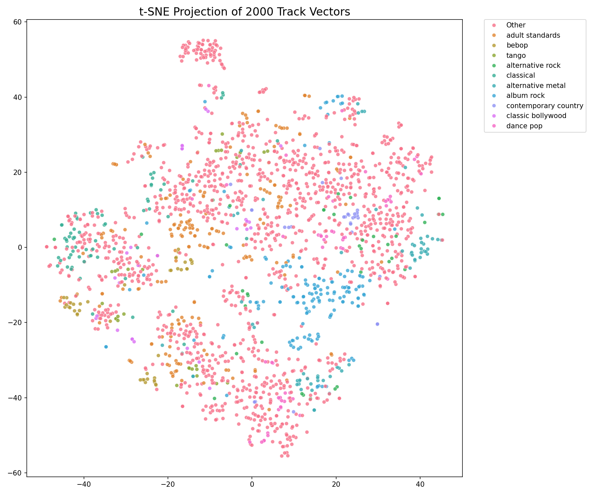
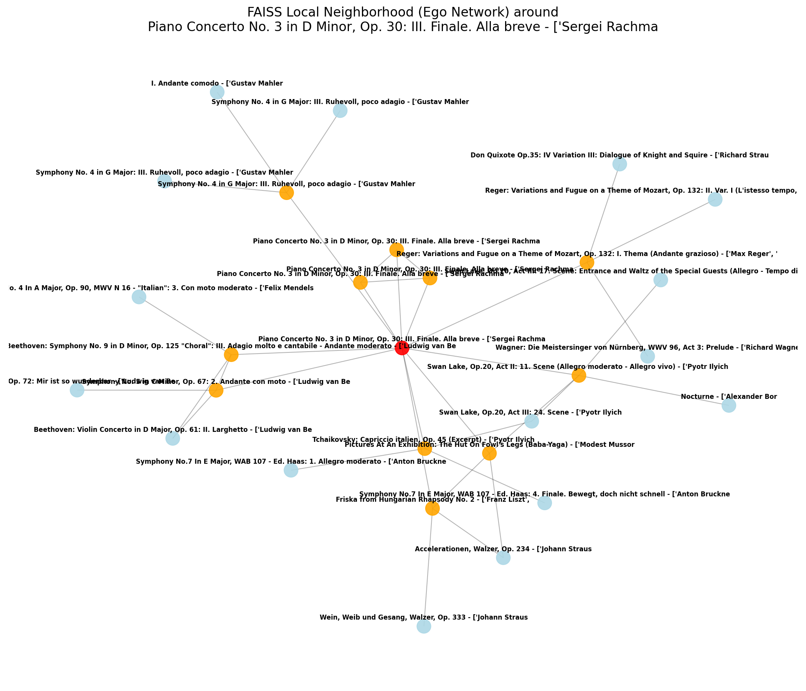
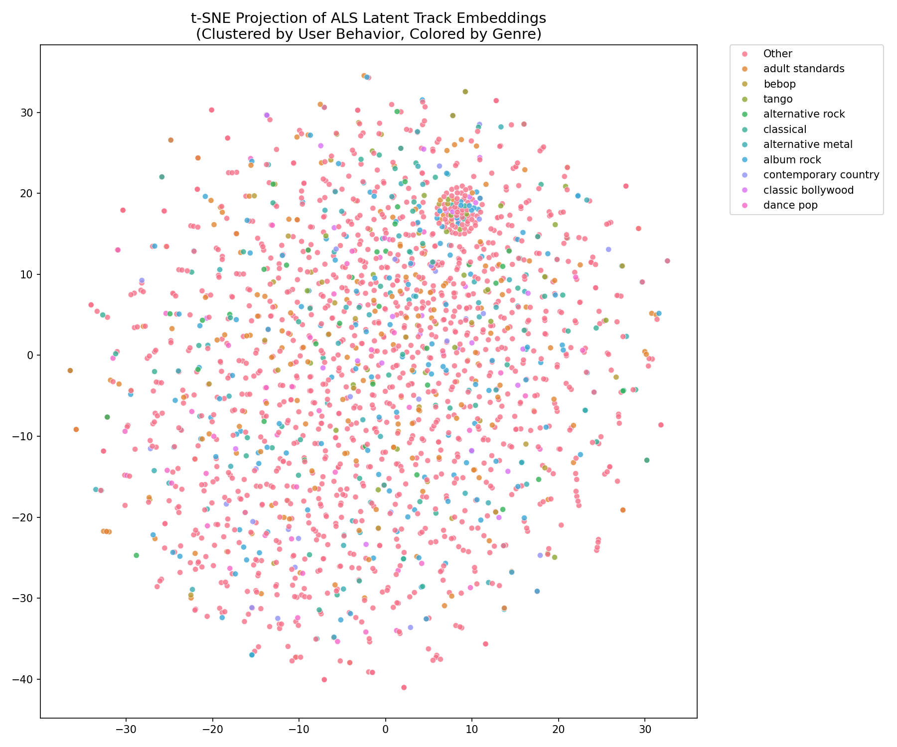

# FAISS Approximate Nearest Neighbors Visualizations

I've successfully generated the visualizations of the feature space and the local graph connections to give you a sense of what the engine has learned!

## 1. Global Structure: t-SNE Dimensionality Reduction (Audio Features)
This scatter plot takes 2,000 random track vectors from our high-dimensional space ($R^{1404}$) and compresses them into a 2D projection. The colors correspond to the track's primary genre. Notice how the vectors naturally cluster into distinct genre "islands", proving that our feature extraction and normalization pipeline successfully separated the content space.

---

## 2. Local Structure: FAISS Ego Network
This graph looks at how the FAISS index actually connects the tracks. We took the very first track in the dataset (the red node), queried its top 12 Nearest Neighbors (the orange nodes), and then queried the neighbors of *those* neighbors (the blue nodes). 

This demonstrates how FAISS HNSW builds overlapping graphs to allow for rapid, sub-linear spatial searching!

---

## 3. Collaborative Space: t-SNE on ALS Track Embeddings
Unlike the audio features graph above, this plot compresses the new 64-dimensional **latent vectors** generated by the Alternating Least Squares (ALS) model. This structure is learned entirely from *user listening behavior*, ignoring the audio entirely! Even though it ignores the audio, you can still see distinct, organic clusters emerging where users tend to binge specific genres together.

