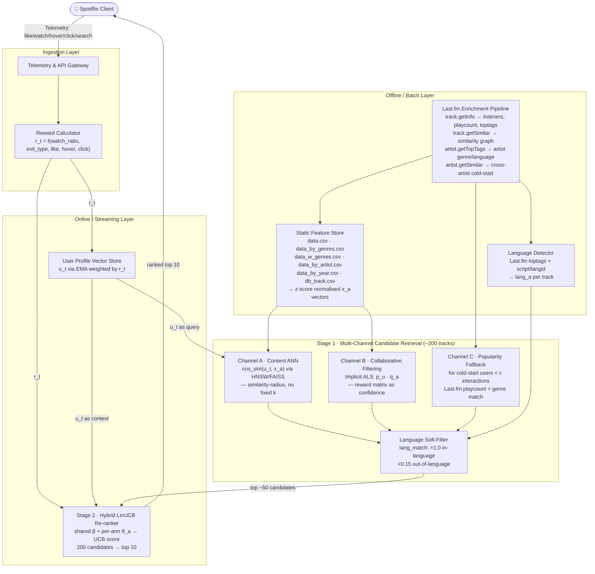

# Spotiflix Recommendation Engine — Revised Architecture & Math Spec

## 0. What changed vs. the original design

| Issue in original design | Fix |
|---|---|
| Stage 1 = content similarity only | Add a collaborative-filtering (ALS) channel + popularity channel, blended |
| LinUCB assigns one arm-model per track → long-tail tracks never converge | Switch to **Hybrid LinUCB** (shared parameter across all arms, small per-arm term only for high-traffic tracks) |
| "User's historical favorites" undefined | Explicit **user profile vector** `u_t`, updated by exponential decay |
| Reward not formalized | Explicit weighted reward function over Like/Watch/Hover/Click/Skip |
| Raw audio features fed into similarity/context | Z-score normalization per feature, fit on `data.csv` |
| No cold-start math | Explicit fallback rule when `n_interactions(user) < τ` |
| **Skip / exit type treated as uniformly negative** | ⚠️ **Manual-next skip is a _weak positive_ signal** — user finished the song and chose "more". The real signal is **watch-time ratio** (`durationWatched / track_duration`). A 2-5 s listen → strong negative regardless of exit type. A 90%+ listen + manual-next → solid positive. Back-button after a short listen → the _strongest_ negative. Exit type now only _modifies_ the watch-time signal, not an independent penalty. |
| Exact content KNN over full catalog | Switch to **Content ANN** (HNSW via FAISS) — sub-linear retrieval, avoids the "best-k" tuning problem entirely: query by similarity-radius, let the returned set size float with catalog density. |
| No language/locale awareness | **Language consistency filter**: detect `lang_a` per track (Last.fm `toptags` + script detection on title). Build a per-user language distribution. Tracks outside the user's active language set are multiplicatively dampened (×0.15), not hard-filtered — preserving a small discovery door. |
| Last.fm API under-utilized | **Full enrichment pipeline**: `track.getInfo` (listeners, playcount, toptags); `track.getSimilar` (pre-computed graph); `artist.getTopTags` (artist-level genre/language); `artist.getSimilar` (cold-start signals). |

---

## 1. Architecture Diagram



---

## 2. Static feature vector (per track)

From `data.csv`, define the raw audio feature vector for track `a`:

```
v_a = [acousticness, danceability, energy, instrumentalness,
       liveness, loudness, speechiness, tempo, valence, key, mode]
```

`duration_ms` and `popularity` are kept separate (used as side-features, not in the similarity space, since scale/interpretation differ).

**Normalization** (fit once, batch, over the full `data.csv`):

```
x_a[i] = ( v_a[i] - mean_i ) / std_i        for each feature i
```

Store `mean_i`, `std_i` per feature in the offline feature store. `x_a` is the vector actually used everywhere below (never raw `v_a`).

Genre one-hot / embedding: from `data_w_genres.csv`, build a genre vector `g_a` (multi-hot over top-N genres, or a learned embedding via co-occurrence). Final static context:

```
x_a = concat( x_a_audio ,  g_a )              ∈ R^d
```

---

## 3. User profile vector `u_t`

For user `u`, maintain a vector in the same space `R^d` as `x_a`, updated on every interaction event using an exponentially-weighted moving average, weighted by that event's reward:

```
u_t = ( 1 - α ) * u_{t-1} + α * r_t * x_{a_t}
```

- `α` ∈ (0,1] — decay rate (e.g. 0.1). Higher α = faster taste drift adaptation.
- `r_t` — reward of the just-completed interaction (Section 4). Using reward as the weight means dislikes/skips *pull the profile away* from that track's region, likes pull it toward.
- Initialize `u_0` = mean genre vector of the user's first N searches/clicks, or global popularity-weighted centroid for a brand-new user (cold start).

This single object is what replaces the hand-wavy "user's historical favorites" — it's what Stage 1's Channel A queries against, and it's part of Stage 2's context vector.

---

## 4. Reward function

**Key correction from the first draft:** watch-time ratio is the primary implicit signal, not skip type. A "manual" skip (clicked next) is *not* inherently negative — most of the time it means the user finished the song and actively chose to move on, which is a healthy engagement pattern. What actually indicates rejection is a **short watch time**, especially combined with an explicit **back-button** press. So exit type (`manual` / `back` / `closed` / `auto`) should modify the severity/sign of the watch-ratio signal, not act as its own independent penalty term (the original draft double-counted this by having both a completion term and a separate skip term).

> **Schema note:** `db_watchhistory.csv`'s `skipSource` enum (`manual`/`closed`/`auto`) doesn't currently distinguish a back-button press from a generic `closed` exit. Recommend adding a 4th value, e.g. `back`, or a separate boolean `wasBackButton`, so the reward calculator can tell "left the player" apart from "explicitly went back."

```
r_t =  w1 * L_t
     + w2 * W_t
     + w3 * H_t
     + w4 * K_t
```

- **Like signal** `L_t` — from `db_like.csv`: `+1` if `isLike=1`, `-1` if `isLike=0`, else `0`. Suggested `w1 = 3.0` (explicit feedback, lowest noise).

- **Watch/Exit signal `W_t`** (from `db_watchhistory.csv`) — the dominant implicit signal. First compute the raw engagement level from watch ratio, centered so under-half-listened is negative and over-half is positive:
  ```
  ratio = clip( durationWatched / track_duration_seconds, 0, 1 )
  E     = 2 * ratio - 1                     # in [-1, 1]; ratio=0.05 (2-5s) -> ~ -0.9, ratio=0.9 -> +0.8
  ```
  Then let exit type modify `E` — but only in the direction that matches the intuition above: exit type *amplifies a negative* (an explicit rejection making a short listen look worse) but only mildly *bonuses a positive* (finishing then choosing "next" is a good sign, not a bad one):
  ```
  if E < 0:                     # short / low-engagement listen
      W_t = E * ρ(exitType)
  else:                          # E >= 0, meaningful listen
      W_t = E + bonus(exitType)
  ```
  ```
  ρ(exitType):        back = 1.5     closed = 1.0     manual = 0.6     auto = 0.3
  bonus(exitType):     back = -0.1    closed = 0        manual = 0.15   auto = 0     (completed naturally: +0.1)
  ```
  Reading the table: a **back-button press after a 3-second listen** gives `E ≈ -0.9`, amplified by `ρ_back = 1.5` → a strongly negative `W_t` (clipped to -1) — the explicit-rejection case you called out. A **manual "next" after listening to 90% of the track** gives `E ≈ +0.8`, plus `bonus_manual = 0.15` → a solid positive — captures "finished, wants more" instead of penalizing it. An **auto-timeout** (likely just inactivity, not judgment) stays muted in both directions. Clip `W_t` to `[-1, 1]`. Suggested `w2 = 2.5` (this is now your strongest implicit signal, per your point that watch time — not skip type — carries the real information).

- **Hover signal** `H_t` — from `db_hoverhistory.csv`, log-compressed:
  ```
  H_t = min( log(1 + durationMs) / log(1 + 10000), 1 )
  ```
  Suggested `w3 = 0.3` (passive, low confidence).

- **Click-source signal** `K_t` — from `db_clickhistory.csv`:
  ```
  K_t = 0.5 if source='recommendation',  0.2 if 'browse',  0.1 if 'search'
  ```
  Suggested `w4 = 0.2`.

Clip final `r_t` to `[-3, 3]`.

> Tune `w1..w4` and the `ρ`/`bonus` tables via offline replay against held-out `db_watchhistory` + `db_like` before deploying live — these are reasonable priors, not fitted constants. In particular, replay is the only reliable way to check whether `ρ_back = 1.5` is actually the right amplification factor for your user base, versus e.g. 1.2 or 2.0.

---

## 5. Stage 1 — Multi-channel candidate retrieval

Blend three channels into one candidate pool of ~200 tracks, then keep top-K (e.g. 50) by blended score, before handing to Stage 2.

**Channel A — Content ANN (not exact KNN)**
Exact KNN means a brute-force `O(catalog size)` similarity scan for every request, and it forces you to hand-pick a single global `k`. Instead, index `x_a` for the whole catalog in an **Approximate Nearest Neighbor** structure (HNSW via FAISS, or ScaNN) built offline and refreshed on the same batch cadence as the feature store:
```
score_content(a) = cosine_similarity( u_t , x_a )     # same math as before
candidates_A = ANN_index.query( u_t, ef_search=... )  # sub-linear lookup, not exhaustive
```
Two practical wins over exact KNN: (1) query latency stays roughly flat as the catalog grows, and (2) instead of a fixed `k`, you can query by a **similarity-radius / distance threshold** and let the returned-set size float — sidestepping the "what's the best k" tuning problem, since the index naturally returns more neighbors in dense taste-regions and fewer in sparse ones. Re-tune `ef_search`/threshold via offline recall@k evaluation against a brute-force ground truth on a sample, periodically.

**Channel B — Collaborative filtering (implicit ALS)**
Build an implicit feedback matrix `R[user, track]` by aggregating the reward calculator's per-event `r_t` (Section 4) per `(user, track)` pair — this already folds in likes, watch/exit behavior, hover, and click source, so there's no separate weighting to redo here. Factorize via Alternating Least Squares (standard implicit-ALS, Hu/Koren/Volinsky 2008):

```
minimize  Σ_{u,a} c_{u,a} * ( r_{u,a} - p_u^T q_a )^2   +   λ ( ||p_u||^2 + ||q_a||^2 )
```
where `c_{u,a} = 1 + β * |r_{u,a}|` (confidence scales with interaction strength), `p_u` = learned user latent factor, `q_a` = learned track latent factor.

```
score_cf(a) = p_u^T q_a
```

**Channel C — Popularity / genre fallback** (used when user has < τ interactions, e.g. τ = 5):
```
score_pop(a) = popularity_a * genre_match(u_partial_profile, a)
```

**Blend:**
```
score_1(a) = γ1 * score_content(a) + γ2 * score_cf(a) + γ3 * score_pop(a)
```
with `γ3` dominant (≈0.8) for cold-start users and decaying toward `γ1, γ2` dominant as `n_interactions` grows — e.g. `γ3 = max(0, 1 - n_interactions/50)`, and `γ1, γ2` scaled to fill the remainder.

**Language soft-filter** (see Section 7 for how `lang_a` and the user's language distribution are built): rather than a hard filter (which kills discovery), apply a multiplicative dampener to tracks whose language falls outside the user's active set:
```
score_1'(a) = score_1(a) * lang_match(u, a)
lang_match(u, a) = 1.0   if lang_a ∈ active_languages(u)
lang_match(u, a) = 0.15  otherwise   # heavily dampened, not zeroed — keeps a small discovery/exploration door open
```

Take the top ~50 tracks by `score_1'(a)` as the candidate set passed to Stage 2.

---

## 6. Stage 2 — Hybrid LinUCB re-ranking

This is the key fix over the original design. Instead of one independent linear model per track (which starves long-tail arms of data), use the **hybrid linear bandit** (Li, Chu, Langford, Schapire 2010):

**Context vectors** for candidate `a` at time `t`:
- Shared context `z_{t,a} ∈ R^k` — cross features that generalize across *all* tracks: e.g. `[u_t ⊙ x_a` (element-wise product), `time_of_day`, `session_position]`. One shared parameter is learned from this across the whole catalog.
- Arm-specific context `x_{t,a} ∈ R^d` — the track's own static feature vector, only meaningfully paired with a per-arm parameter once the arm has enough plays.

**Reward model:**
```
E[ r_t | z_{t,a}, x_{t,a} ] = z_{t,a}^T β  +  x_{t,a}^T θ_a
```

- `β` — single shared parameter vector, updated from **every** interaction across **every** track. This is what lets even zero-history tracks get a sensible score.
- `θ_a` — per-arm parameter, only maintained for tracks with `n_plays(a) ≥ τ_arm` (e.g. τ_arm = 20). Below that threshold, use `θ_a = 0` and rely on `β` alone.

**Ridge regression update (closed form, standard LinUCB machinery):**

Shared component, maintained globally:
```
A_0 ← A_0 + z_{t,a} z_{t,a}^T          (A_0 initialized to identity I_k)
b_0 ← b_0 + r_t * z_{t,a}
β   = A_0^{-1} b_0
```

Per-arm component (only for hot arms):
```
A_a ← A_a + x_{t,a} x_{t,a}^T          (A_a initialized to identity I_d)
b_a ← b_a + r_t * x_{t,a}
θ_a = A_a^{-1} b_a
```

**UCB score at serving time:**
```
p_t(a) = z_{t,a}^T β + x_{t,a}^T θ_a
         + α_ucb * sqrt( z_{t,a}^T A_0^{-1} z_{t,a} + x_{t,a}^T A_a^{-1} x_{t,a} )
```

- The first term is the exploitation estimate (predicted reward).
- The second term is the exploration bonus — high when the model is uncertain about this context (few similar past observations), encouraging occasional surfacing of under-explored tracks.
- `α_ucb` (e.g. 0.5–1.0) controls explore/exploit tradeoff; tune down over time as the system matures, or make it session-adaptive (higher for new users).

**Final ranking:** sort the ~50 candidates from Stage 1 by `p_t(a)` descending, serve top 10.

**Update loop:** after each interaction, compute `r_t` (Section 4), update `A_0, b_0` always, and `A_a, b_a` only if `a` is a hot arm; update `u_t` (Section 3) in parallel.

---

## 7. Cold start summary

| Situation | Handling |
|---|---|
| New user, 0 interactions | `u_0` = global popularity-weighted genre centroid; Stage 1 uses Channel C almost exclusively (`γ3 ≈ 1`) |
| New user, few interactions | `u_t` updates via EMA as events arrive; `γ3` decays as `n_interactions` grows |
| New track, few plays | Stage 1 Channel A/B still find it via content similarity / ALS (no interactions needed there); Stage 2 relies on shared `β` only (`θ_a = 0`) — never orphaned into a permanently-cold arm model |

---

## 8. Last.fm API Enrichment Pipeline

All enrichment runs as an **offline batch job** (e.g. nightly) and writes into the Static Feature Store. The following endpoints are used:

| Endpoint | Key fields extracted | ML use |
| :--- | :--- | :--- |
| `track.getInfo` | `listeners`, `playcount`, `toptags[].name`, `duration` | Popularity signal for Channel C; tag-based genre + **language detection** |
| `track.getSimilar` | `track[].name`, `track[].artist`, `track[].match` (0–1 similarity score) | Pre-computed Last.fm similarity graph — excellent cold-start prior for new users / new tracks; can seed ANN index |
| `track.getTopTags` | `tag[].name`, `tag[].count` | Richer genre/mood/language tagging than Spotify data alone |
| `artist.getTopTags` | `tag[].name`, `tag[].count` | Fallback when track-level tags are sparse; also feeds `lang_a` detection |
| `artist.getSimilar` | `artist[].name`, `artist[].match` | Cross-artist similarity for cold-start; augments Channel B's ALS with an explicit prior |
| `tag.getTopTracks` | `track[].name`, `track[].playcount` | Seed popularity fallback lists per genre for Channel C |

**Language detection from `toptags`**: Last.fm users frequently tag tracks with the language (e.g. `"russian"`, `"k-pop"`, `"japanese"`, `"hindi"`) or script-identifiable names. The enrichment pipeline applies the following heuristic:

1. Pull `toptags` for each track/artist.
2. Match tag names against a language/locale dictionary (e.g. `{"russian", "rus"} → "ru"`, `{"korean", "k-pop"} → "ko"`).
3. Fall back to Unicode script detection on the track `name` field (e.g. Cyrillic → `"ru"`, Hangul → `"ko"`).
4. Store `lang_a` as a BCP-47 language code on each track in the feature store.

**Freshness-adjusted popularity** from Last.fm:
```
popularity_enriched(a) = log(1 + playcount_a) * freshness_factor(release_year_a)
freshness_factor(y)    = exp( -λ * (current_year - y) )    # λ ~ 0.05
```
This prevents the Channel C fallback from being permanently dominated by decade-old evergreen tracks.

---

## 9. Implementation notes

- Fit feature normalization stats (`mean_i`, `std_i`) and refresh the ALS factors (`p_u`, `q_a`) as an offline batch job (e.g. nightly or hourly), not online.
- `u_t`, `A_0`, `b_0`, and hot-arm `A_a`/`b_a` update online/streaming, per interaction, from the Telemetry Gateway.
- Log `r_t`, `p_t(a)`, and which arm was hot/cold at serving time — this is what you'll need later to do offline replay evaluation (counterfactual policy evaluation) before shipping any change to `w1..w5` or `α_ucb`.
- Recommend starting `α_ucb` higher during the first few weeks of launch (more exploration while `β` is uninformed), then decaying it as cumulative interaction volume grows.
- The `skipSource` enum in `db_watchhistory.csv` currently covers `manual` / `closed` / `auto`. **Recommend adding a `back` value** (or a boolean `wasBackButton`) so the reward calculator can distinguish "user explicitly went back" from "user just closed the player" — this is the distinction that drives the strongest negative signal in `W_t`.